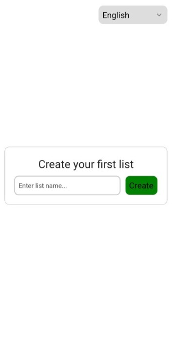
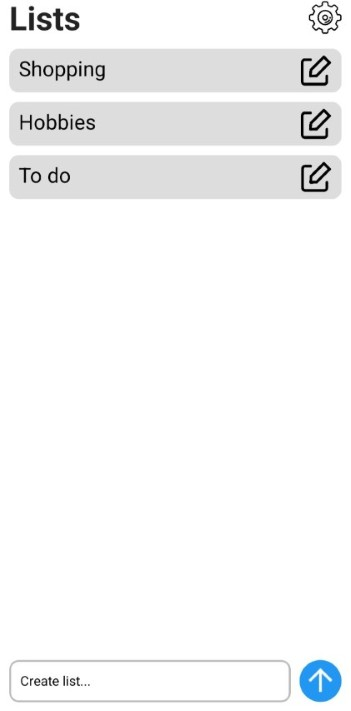
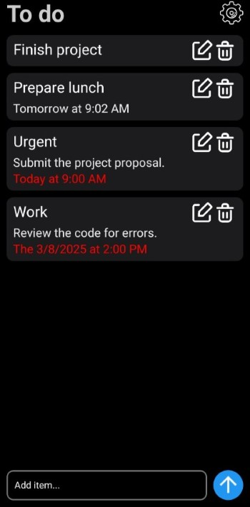
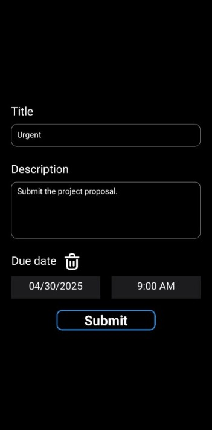

# ToDo

> A simple to-do app that lets you create multiple lists cantaining items that support title, description and a due date.

# Screenshots





## Features

- **Multilanguage** - Currently supports: English, Italian
- **Ligh/Dark Themes** - Supports light, dark and automatic (based on device theme) theme options
- **Instant update** - The theme and language update instantly when changed, no need to restart the app
- **Storage** - The data is stored locally

## Development environment

The app has been tested using:
- [React Native](https://reactnative.dev/) (0.76.7)
- [Node.js](https://nodejs.org/) (22.14.0)
- [npm](https://www.npmjs.com/) (10.9.2)
- [React Native Community CLI](https://github.com/react-native-community/cli) (15.0.1)
- Phone running Android 15

⚠️ The app has not been tested on iOS devices

## Installation

```bash
# Clone the repository
git clone https://github.com/Andrea9530/ToDo.git

# Navigate to the project directory
cd ToDo

# Install dependencies
npm install

cd android && ./gradlew clean

cd ..
```

## Running the App

```bash
# Start Metro bundler
npm start

# Run on Android
npm run android
```

## Build and Deployment

### Android

```bash
# Generate release APK
cd android && ./gradlew clean && ./gradlew assembleRelease
```
You will find the APK at: android/app/build/outputs/apk/release/app-release.apk

